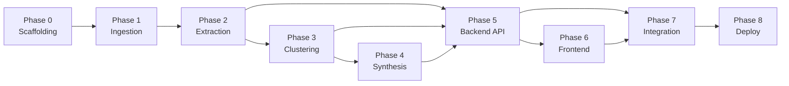

# Phase-Wise Implementation Plan
## AI-Powered Discovery Engine — Google Photos Vague Retrieval

> **Total Estimated Timeline:** 6–8 weeks (single developer) · 3–4 weeks (2-person team)
> **References:** [context.md](file:///C:/Users/aditi/OneDrive/Desktop/GOOGLE%20PHOTOS/context.md) · [architecture.md](file:///C:/Users/aditi/OneDrive/Desktop/GOOGLE%20PHOTOS/architecture.md)

---

## Phase 0 — Project Scaffolding & Environment Setup
**Duration:** 1–2 days · **Risk:** Low · **Dependency:** None

### Objectives
Set up the mono-repo, install all dependencies, configure API keys, and verify connectivity to every external service before writing pipeline code.

### Tasks

| # | Task | Details | Done |
|---|---|---|---|
| 0.1 | **Create project root** | Initialize `google-photos-discovery-engine/` with the directory structure defined in [architecture.md §5](file:///C:/Users/aditi/OneDrive/Desktop/GOOGLE%20PHOTOS/architecture.md) | ☑ |
| 0.2 | **Backend Python environment** | Create `pyproject.toml` (or `requirements.txt`) with all dependencies: `google-genai`, `fastapi`, `uvicorn`, `asyncpg`, `aiohttp`, `praw`, `google-play-scraper`, `beautifulsoup4`, `playwright`, `scikit-learn`, `hdbscan`, `umap-learn`, `numpy`, `pandas` | ☑ |
| 0.3 | **Frontend scaffold** | Run `npx -y create-vite@latest ./ --template react` inside `frontend/`. Install `axios`, `recharts`, `react-router-dom` | ☑ |
| 0.4 | **Environment variables** | Create `.env.example` and `.env` (gitignored) with: `GEMINI_API_KEY`, `REDDIT_CLIENT_ID`, `REDDIT_CLIENT_SECRET`, `DATABASE_URL`, `YOUTUBE_API_KEY` | ☑ |
| 0.5 | **PostgreSQL + pgvector** | Provision a PostgreSQL 16 instance (local Docker or cloud). Run `CREATE EXTENSION vector;`. Execute the full DDL from [architecture.md §3.3](file:///C:/Users/aditi/OneDrive/Desktop/GOOGLE%20PHOTOS/architecture.md) to create `feedback_records`, `clusters`, `synthesis_answers`, `ingestion_log` tables | ☑ |
| 0.6 | **Connectivity smoke tests** | Write a `scripts/smoke_test.py` that verifies: Gemini API key works (simple generate call), Reddit API authenticates, PostgreSQL accepts connections, YouTube API returns data | ☑ |
| 0.7 | **Git init + .gitignore** | Initialize repo; gitignore `.env`, `__pycache__`, `node_modules/`, `data/raw/`, `*.jsonl` | ☑ |

### Exit Criteria
- `python scripts/smoke_test.py` passes all 4 connectivity checks.
- `npm run dev` serves the Vite React scaffold at `localhost:5173`.
- All database tables exist and accept inserts.

---

## Phase 1 — Data Ingestion Pipeline
**Duration:** 5–7 days · **Risk:** Medium (API rate limits, pagination edge cases) · **Dependency:** Phase 0

### Objectives
Build four async scrapers that collectively produce 10,000–12,000 raw user complaints in `.jsonl` format, with deduplication, rate limiting, and checkpoint/resume support.

### Tasks

| # | Task | Details | Target Volume | Done |
|---|---|---|---|---|
| 1.1 | **Base scraper class** | Create `ingestion/base_scraper.py`: abstract async class with `asyncio.Semaphore` rate limiter, exponential backoff (base=1s, max=60s, jitter), `.jsonl` append writer, cursor-based checkpoint/resume, SHA-256 Bloom filter dedup | — | ☑ |
| 1.2 | **Reddit scraper** | `ingestion/reddit_scraper.py`: Use `asyncpraw` to query `r/googlephotos`, `r/Android`, `r/photography`. Search terms: `"can't find photo"`, `"search not working"`, `"lost photo"`, `"missing photo"`, `"remember photo"`. Pull both submissions and comments. Paginate through historical results (up to 2 years back) | 3,000–4,000 | ☑ |
| 1.3 | **App Store scraper** | `ingestion/appstore_scraper.py`: Use `google-play-scraper` for Play Store, `app-store-scraper` (via subprocess/npm) for Apple. Filter: 1–3 star reviews containing keywords `find`, `search`, `lost`, `remember`, `missing`. Paginate through all available reviews | 3,000–4,000 | ☑ |
| 1.4 | **Help Forum scraper** | `ingestion/helpforum_scraper.py`: Use `aiohttp` + `BeautifulSoup` (or Playwright for JS-rendered pages) to crawl Google Photos Help Community. Target threads tagged with search/missing/find. Extract thread body + replies | 2,000–3,000 | ☑ |
| 1.5 | **YouTube/Social scraper** | `ingestion/youtube_scraper.py`: Use YouTube Data API v3 to find Google Photos search tutorial videos, then pull all comment threads. Optionally add Twitter/X API if keys available | 1,000–2,000 | ☑ |
| 1.6 | **Ingestion orchestrator** | `ingestion/run_ingestion.py`: Runs all 4 scrapers concurrently via `asyncio.gather()`. Logs progress to `ingestion_log` table. Writes partitioned `.jsonl` to `data/raw/{source}/{date}/{batch}.jsonl` | 10,000–12,000 | ☑ |
| 1.7 | **Manual data audit** | Spot-check 50 random records from each source. Verify: correct encoding, no truncation, metadata present, no obvious duplicates | — | ☐ |

### Raw Record Schema (each `.jsonl` line)
```json
{
  "source_platform": "reddit",
  "url_id": "https://reddit.com/r/googlephotos/comments/abc123/comment/xyz",
  "raw_text": "I know I took a photo of my dog at the beach last summer but Google Photos can't find it...",
  "scraped_at": "2026-09-18T12:00:00Z",
  "metadata": { "subreddit": "googlephotos", "score": 42 }
}
```

### Risk Mitigations
| Risk | Mitigation |
|---|---|
| Reddit API rate limits (100 req/min) | `asyncio.Semaphore(2)` + 0.6s delay between requests |
| App Store scraper blocking | Rotate User-Agent strings; add 2s random delay between pages |
| Help Forum JS rendering | Use Playwright with headless Chromium as fallback |
| Volume shortfall (< 10K) | Broaden keyword list; add Quora, Twitter/X as supplementary sources |

### Exit Criteria
- `data/raw/` contains ≥ 10,000 `.jsonl` records across all sources.
- `ingestion_log` table shows completion status for all batches.
- Dedup Bloom filter confirms < 2% duplicate rate.

---

## Phase 2 — Gemini Extraction Pipeline
**Duration:** 4–5 days · **Risk:** Medium (Batch API latency, schema validation) · **Dependency:** Phase 1

### Objectives
Process all raw records through the Gemini Batch API with Structured Outputs to produce strictly typed extraction records. Validate, filter, and store the results in PostgreSQL.

### Tasks

| # | Task | Details | Done |
|---|---|---|---|
| 2.1 | **Define extraction schema** | `extraction/schema.py`: Implement the full JSON Schema from [architecture.md §3.2](file:///C:/Users/aditi/OneDrive/Desktop/GOOGLE%20PHOTOS/architecture.md) as a Python dict. Include all 12 fields with types, enums, and descriptions. Store the system prompt as a constant | ☐ |
| 2.2 | **Batch preparation service** | `extraction/batch_processor.py`: Read `.jsonl` files in chunks of 1,000 records. For each chunk, construct a Gemini Batch API request payload with `responseFormat` set to the JSON Schema. Submit up to 10 concurrent batch jobs | ☐ |
| 2.3 | **Batch job polling** | Add polling loop (30s interval) that checks batch job status. On completion, download results. On failure, retry up to 3 times with exponential backoff | ☐ |
| 2.4 | **Post-extraction validation** | `extraction/validator.py`: Parse each Gemini response. Validate against schema (type checks, enum membership). Discard records where `is_retrieval_attempt == false`. Log discard rate (expect 15–20%) | ☐ |
| 2.5 | **Database insertion** | Bulk-insert valid records into `feedback_records` table using `asyncpg` `COPY` command. Handle `url_id` UNIQUE constraint conflicts gracefully (skip duplicates) | ☐ |
| 2.6 | **Extraction audit** | Sample 100 records. Manually verify extraction quality: are `remembered_attributes` and `forgotten_attributes` accurate? Is `photo_type` correctly inferred? Document accuracy rate | ☐ |

### Key Implementation Details

**System prompt** (stored in `schema.py`):
```
You are a data extraction agent specializing in user-experience failure analysis
for Google Photos. Given a raw user complaint about photo search or retrieval:

1. Determine if this text describes a SPECIFIC attempt to find/retrieve a photo.
2. If yes, extract every field in the output schema from the narrative.
   - Be exhaustive with remembered_attributes and forgotten_attributes.
   - Infer the closest photo_type category.
   - Assess emotional_signal from tone and stakes described.
3. If no, set is_retrieval_attempt to false.

Be precise. Do not hallucinate attributes the user did not mention.
```

**Batch API call pattern** (pseudocode):
```python
import google.genai as genai

client = genai.Client(api_key=GEMINI_API_KEY)

batch_job = client.batches.create(
    model="gemini-2.0-flash",
    src=input_jsonl_uri,           # GCS or inline
    dest=output_jsonl_uri,
    config=types.CreateBatchJobConfig(
        response_mime_type="application/json",
        response_schema=EXTRACTION_SCHEMA,
        system_instruction=SYSTEM_PROMPT,
    )
)
```

### Exit Criteria
- `feedback_records` table contains ≥ 8,000 valid extraction records (after filtering).
- Extraction accuracy ≥ 85% on manual 100-sample audit.
- All batch jobs completed without unrecoverable errors.
- Discard rate logged and within expected 15–20% range.

---

## Phase 3 — Embedding & Clustering Pipeline
**Duration:** 3–4 days · **Risk:** Low-Medium · **Dependency:** Phase 2

### Objectives
Generate vector embeddings for all extracted records, cluster them into distinct failure patterns, compute cluster metrics, and generate human-readable cluster labels.

### Tasks

| # | Task | Details | Done |
|---|---|---|---|
| 3.1 | **Embedding generation** | `clustering/embedder.py`: For each record, concatenate `failure_point` + `" | "` + `search_strategy`. Batch-embed using Gemini `text-embedding-004` (100 texts per API call). Store resulting 768-d vectors in `feedback_records.embedding` column | ☐ |
| 3.2 | **Dimensionality reduction** | Load all embeddings into a NumPy matrix. Apply UMAP (`n_components=50`, `metric='cosine'`) to reduce dimensionality before clustering | ☐ |
| 3.3 | **HDBSCAN clustering** | `clustering/cluster_engine.py`: Run HDBSCAN (`min_cluster_size=30`, `min_samples=10`, `metric='euclidean'` on UMAP output). If HDBSCAN produces < 5 clusters, fall back to K-Means with silhouette-optimized k (range 8–20) | ☐ |
| 3.4 | **Assign cluster IDs** | Write `cluster_id` back to each `feedback_records` row. Records labeled as noise by HDBSCAN get `cluster_id = -1` | ☐ |
| 3.5 | **Compute cluster metrics** | `clustering/metrics.py`: For each cluster, compute: `record_count`, `source_diversity` (count per platform), `severity_score` using the composite formula from [architecture.md §3.4.3](file:///C:/Users/aditi/OneDrive/Desktop/GOOGLE%20PHOTOS/architecture.md). Extract top-5 failure points and 5–10 representative quotes | ☐ |
| 3.6 | **Generate cluster labels** | `clustering/labeler.py`: For each cluster, send the 10 most representative records to `gemini-2.0-flash` with prompt: "Generate a concise 3-5 word label for this group of Google Photos search failures." Store label + AI-generated description | ☐ |
| 3.7 | **Compute cluster centroids** | Calculate the mean embedding vector for each cluster. Store in `clusters.centroid` column (used for nearest-cluster assignment in the real-time testing feature) | ☐ |
| 3.8 | **Write cluster metadata** | Insert all cluster data into the `clusters` table | ☐ |
| 3.9 | **Cluster quality review** | Visualize clusters using 2D UMAP projection (save as PNG). Review the top 5 clusters manually: do labels make sense? Are quotes coherent within each cluster? | ☐ |

### Severity Score Formula
```
severity_score = (
    0.40 × emotional_weight        # weighted avg of emotional signals
  + 0.30 × workaround_weight       # fraction of "gave_up" workarounds
  + 0.20 × frequency_weight        # cluster_size / total_records (normalized)
  + 0.10 × source_diversity_weight  # num distinct sources / total_sources
)
```

### Exit Criteria
- All records have non-null `embedding` and `cluster_id` values.
- `clusters` table contains 8–20 clusters with complete metadata.
- Each cluster has a human-readable label and ≥ 5 representative quotes.
- 2D UMAP visualization shows visually distinct cluster separation.
- Noise records (cluster_id = -1) are < 10% of total.

---

## Phase 4 — AI Synthesis Engine
**Duration:** 2–3 days · **Risk:** Low · **Dependency:** Phase 3

### Objectives
Use Gemini to analyze the entire clustered dataset and generate explicit, evidence-backed answers to the five core strategic questions.

### Tasks

| # | Task | Details | Done |
|---|---|---|---|
| 4.1 | **Prepare synthesis context** | `synthesis/synthesizer.py`: Query all cluster metadata from `clusters` table. For each cluster, include: label, description, record_count, severity_score, source_diversity, top_failure_points, representative_quotes. Format as a structured prompt | ☐ |
| 4.2 | **Define the 5 core questions** | Hardcode the questions as constants: Q1 (photo types), Q2 (remembered info), Q3 (forgotten info), Q4 (search formulation), Q5 (highest churn cluster) | ☐ |
| 4.3 | **Run synthesis call** | Send the full cluster context + 5 questions to `gemini-2.0-flash` (or `gemini-1.5-pro` for deeper reasoning). System prompt: "You are a product research analyst. Analyze the clustered dataset below and provide evidence-backed answers to each question. Cite cluster IDs, record counts, and verbatim user quotes." | ☐ |
| 4.4 | **Parse structured answers** | Extract per-question answers with cited evidence (cluster IDs, quote references, percentages). Use Structured Outputs to guarantee response format | ☐ |
| 4.5 | **Store in database** | Insert each Q&A pair into `synthesis_answers` table with `question_text`, `answer_text`, `evidence` (JSONB), and `generated_at` timestamp | ☐ |
| 4.6 | **Quality review** | Read all 5 answers. Verify: answers are specific (not generic), cite real cluster data, quotes are verbatim from the dataset. Flag any hallucinated evidence | ☐ |

### Synthesis Output Schema
```json
{
  "question_id": 1,
  "question_text": "What kinds of old photos do users struggle to retrieve?",
  "answer_text": "Users most frequently struggle to retrieve old vacation photos (Cluster #1, n=842, severity 0.91), followed by documents and receipts (Cluster #2, n=731)...",
  "evidence": {
    "cited_clusters": [1, 2, 3],
    "key_metrics": { "top_photo_type": "old_vacation", "percentage": 34.2 },
    "verbatim_quotes": [
      "I scrolled for 20 minutes trying to find our beach trip photos from 2022...",
      "Google Photos can't find a receipt I photographed last month..."
    ]
  }
}
```

### Exit Criteria
- `synthesis_answers` table contains 5 rows, one per core question.
- Each answer cites ≥ 2 cluster IDs and ≥ 2 verbatim quotes.
- No hallucinated evidence (all cited clusters exist in `clusters` table).
- Answers are substantive (≥ 150 words each) and actionable for a PM audience.

---

## Phase 5 — FastAPI Backend
**Duration:** 3–4 days · **Risk:** Low · **Dependency:** Phases 2–4

### Objectives
Build the REST API that powers all three frontend views plus the real-time analysis feature.

### Tasks

| # | Task | Details | Done |
|---|---|---|---|
| 5.1 | **Database connection pool** | `db/connection.py`: Create an `asyncpg` connection pool. Expose `get_db()` dependency for FastAPI routes | ☐ |
| 5.2 | **Pydantic models** | `api/models.py`: Define request/response models for all endpoints: `InsightResponse`, `ClusterListResponse`, `ClusterDetailResponse`, `AnalyzeRequest`, `AnalyzeResponse`, `StatsResponse`, `SchemaResponse` | ☐ |
| 5.3 | **GET /api/insights** | `api/routes/insights.py`: Query `synthesis_answers` table. Return all 5 Q&A pairs with evidence | ☐ |
| 5.4 | **GET /api/clusters** | `api/routes/clusters.py`: Query `clusters` table. Return ranked list sorted by severity_score descending. Support query params: `sort_by`, `limit`, `offset` | ☐ |
| 5.5 | **GET /api/clusters/{id}** | Return full cluster detail: label, description, metrics, attribute breakdowns (aggregated from `feedback_records`), representative quotes | ☐ |
| 5.6 | **GET /api/clusters/{id}/records** | Paginated raw records for a cluster. Support `page` and `page_size` query params | ☐ |
| 5.7 | **POST /api/analyze** | `api/routes/analyze.py`: Accept `{ "raw_text": "..." }`. Call Gemini `gemini-2.0-flash` with the same extraction schema (live, not batch). Embed the extraction result using `text-embedding-004`. Query `clusters.centroid` for nearest cluster via cosine similarity. Return parsed JSON + nearest cluster info | ☐ |
| 5.8 | **GET /api/stats** | `api/routes/stats.py`: Return aggregate stats: total records, cluster count, source distribution, avg severity | ☐ |
| 5.9 | **GET /api/schema** | Return the exact JSON Schema and system prompt used for Gemini extraction (required by Definition of Done) | ☐ |
| 5.10 | **CORS middleware** | Add CORS middleware allowing `localhost:5173` (Vite dev) and production frontend origin | ☐ |
| 5.11 | **Error handling** | Global exception handler returning structured error JSON. Handle Gemini API errors gracefully in `/api/analyze` | ☐ |
| 5.12 | **API smoke tests** | Write a test script that hits every endpoint and validates response schemas | ☐ |

### API Summary Table

| Method | Endpoint | View Served |
|---|---|---|
| `GET` | `/api/insights` | Insights Dashboard |
| `GET` | `/api/clusters` | Opportunity Table |
| `GET` | `/api/clusters/{id}` | Opportunity Table (drill-down) |
| `GET` | `/api/clusters/{id}/records` | Opportunity Table (drill-down) |
| `POST` | `/api/analyze` | Real-Time Testing |
| `GET` | `/api/stats` | All views (stats bar) |
| `GET` | `/api/schema` | Schema Viewer |

### Exit Criteria
- All 7 endpoints return correct data with proper HTTP status codes.
- `/api/analyze` completes in < 5 seconds for a single complaint.
- API smoke test script passes on all endpoints.
- OpenAPI docs available at `/docs` (auto-generated by FastAPI).

---

## Phase 6 — React Frontend
**Duration:** 5–7 days · **Risk:** Low · **Dependency:** Phase 5

### Objectives
Build a polished, responsive React web application with three distinct views: Insights Dashboard, Opportunity Table, and Real-Time Testing Input.

### Tasks

| # | Task | Details | Done |
|---|---|---|---|
| 6.1 | **Design system & global styles** | `frontend/src/styles/index.css`: Define CSS custom properties (color palette, typography using Google Fonts `Inter`/`Outfit`, spacing scale, border-radius, shadows). Dark mode as default. Glassmorphism cards. Smooth transitions | ☐ |
| 6.2 | **API client** | `frontend/src/api/client.js`: Axios instance with base URL pointing to FastAPI. Interceptors for error handling | ☐ |
| 6.3 | **App layout & routing** | `frontend/src/App.jsx`: React Router with three routes: `/` (Dashboard), `/opportunities` (Table), `/test` (Testing). Sidebar or top-nav for navigation. `StatsBar` component visible on all pages | ☐ |
| 6.4 | **StatsBar component** | `frontend/src/components/StatsBar.jsx`: Fetches `/api/stats`. Displays: total records, cluster count, source distribution as mini bar chart, pipeline timestamp | ☐ |
| 6.5 | **InsightCard component** | `frontend/src/components/InsightCard.jsx`: Expandable card showing question, AI answer, cited evidence, verbatim quotes in a collapsible section. Subtle gradient border. Hover micro-animation | ☐ |
| 6.6 | **DashboardPage** | `frontend/src/pages/DashboardPage.jsx`: Fetches `/api/insights`. Renders 5 `InsightCard` components. Hero section with project title and aggregate stats | ☐ |
| 6.7 | **ClusterTable component** | `frontend/src/components/ClusterTable.jsx`: Sortable table (rank, label, count, severity, top source). Click row to expand inline detail. Severity column uses color-coded badges (red/orange/yellow/green) | ☐ |
| 6.8 | **ClusterDetail component** | `frontend/src/components/ClusterDetail.jsx`: Fetches `/api/clusters/{id}`. Shows: attribute breakdowns (remembered vs. forgotten as horizontal bar charts), search strategy distribution (pie/donut chart), representative quotes in a scrollable list | ☐ |
| 6.9 | **OpportunityPage** | `frontend/src/pages/OpportunityPage.jsx`: Renders `ClusterTable` with expandable `ClusterDetail` rows. Pagination controls for record drill-down | ☐ |
| 6.10 | **AnalyzeInput component** | `frontend/src/components/AnalyzeInput.jsx`: Large text area with placeholder text. "Analyze" button with loading spinner. Displays extracted JSON in a syntax-highlighted code block. Shows nearest cluster card with cosine similarity score | ☐ |
| 6.11 | **TestPage** | `frontend/src/pages/TestPage.jsx`: Renders `AnalyzeInput`. Below results, show a `SchemaViewer` component that displays the JSON Schema and system prompt (fetched from `/api/schema`) | ☐ |
| 6.12 | **SchemaViewer component** | `frontend/src/components/SchemaViewer.jsx`: Collapsible panels showing the extraction JSON Schema and system prompt. Syntax-highlighted JSON | ☐ |
| 6.13 | **Responsive design** | Ensure all pages work on desktop (1440px+), tablet (768px), and mobile (375px). Use CSS Grid/Flexbox. Test in Chrome DevTools responsive mode | ☐ |
| 6.14 | **Micro-animations & polish** | Add: card hover lift effects, smooth page transitions, loading skeletons, scroll-triggered fade-ins, severity badge pulse animation | ☐ |
| 6.15 | **SEO & meta tags** | `index.html`: Add title, meta description, Open Graph tags. Proper heading hierarchy (single `<h1>` per page) | ☐ |

### UI Wireframe Summary

```
┌─────────────────────────────────────────────────────────────┐
│  [🔍 Discovery Engine]   Dashboard | Opportunities | Test   │
│─────────────────────────────────────────────────────────────│
│  📊 10,247 records · 14 clusters · Reddit 38% · Play 32%   │
│─────────────────────────────────────────────────────────────│
│                                                             │
│  VIEW 1 (Dashboard):    5 × InsightCard (expandable)        │
│  VIEW 2 (Opportunities): ClusterTable → ClusterDetail       │
│  VIEW 3 (Test):          TextArea → JSON + Nearest Cluster  │
│                                                             │
└─────────────────────────────────────────────────────────────┘
```

### Exit Criteria
- All 3 views render correctly with real data from the API.
- Navigation between views is smooth with animated transitions.
- Real-time testing completes and displays results within 5 seconds.
- JSON Schema and system prompt are visible and copy-able in the UI.
- Responsive design works at 375px, 768px, and 1440px widths.

---

## Phase 7 — Integration Testing & Data Quality
**Duration:** 2–3 days · **Risk:** Low · **Dependency:** Phases 5–6

### Objectives
Validate the full end-to-end pipeline, fix data quality issues, and ensure all Definition of Done criteria are met.

### Tasks

| # | Task | Details | Done |
|---|---|---|---|
| 7.1 | **End-to-end pipeline test** | Run `scripts/run_pipeline.py` from scratch on a small subset (500 records). Verify every phase completes and data flows correctly through all tables | ☐ |
| 7.2 | **Full-scale pipeline run** | Execute the complete pipeline on all 10,000+ records. Monitor for errors, timeouts, or data loss at each phase transition | ☐ |
| 7.3 | **Data volume verification** | Confirm ≥ 10,000 records in `feedback_records` table. Confirm all clusters have records and the `clusters` table is fully populated | ☐ |
| 7.4 | **Synthesis answer quality** | Review all 5 AI-generated answers with a PM perspective. Are they specific, actionable, and properly cited? Re-run synthesis if quality is insufficient | ☐ |
| 7.5 | **Real-time testing validation** | Test `/api/analyze` with 10 diverse complaints (from different sources, photo types, failure modes). Verify extraction accuracy and cluster assignment relevance | ☐ |
| 7.6 | **Cross-browser testing** | Test the frontend in Chrome, Firefox, Safari, and Edge. Fix any rendering issues | ☐ |
| 7.7 | **Performance profiling** | Measure: API response times (target < 200ms for reads, < 5s for analyze), frontend load time (target < 3s), database query performance. Add indexes if needed | ☐ |
| 7.8 | **Error handling verification** | Test edge cases: empty text in analyze, invalid cluster IDs, database connection failure. Verify graceful error messages in both API and UI | ☐ |

### Exit Criteria
- All Definition of Done criteria from the [problem statement](file:///C:/Users/aditi/OneDrive/Desktop/GOOGLE%20PHOTOS/context.md) are satisfied:
  - ✅ 10,000+ real retrieval-failure items ingested, parsed, and stored
  - ✅ Web app features AI-generated answers to core strategic questions, backed by data
  - ✅ Interactive "Test the Engine" feature works in real-time
  - ✅ System prompt and JSON Schema are documented and accessible in the UI

---

## Phase 8 — Documentation & Deployment
**Duration:** 1–2 days · **Risk:** Low · **Dependency:** Phase 7

### Tasks

| # | Task | Details | Done |
|---|---|---|---|
| 8.1 | **README.md** | Project overview, setup instructions (Python env, Node env, PostgreSQL, env vars), how to run the pipeline, how to start the dev servers | ☐ |
| 8.2 | **API documentation** | Verify FastAPI auto-generated OpenAPI docs at `/docs` are complete and accurate. Add docstrings to all route handlers | ☐ |
| 8.3 | **1-slide explanation** | Create a concise summary document/slide: what the engine does, the Gemini extraction schema, how clustering works, key findings. This is a required deliverable | ☐ |
| 8.4 | **Deploy backend** | Deploy FastAPI to Railway/Render/Cloud Run. Set environment variables. Verify all endpoints work in production | ☐ |
| 8.5 | **Deploy frontend** | Deploy React app to Vercel. Configure API base URL to point to production backend. Verify all views render correctly | ☐ |
| 8.6 | **Production smoke test** | Hit all production endpoints. Test the real-time analyze feature. Verify data loads correctly in all 3 views | ☐ |
| 8.7 | **Export report** | Run `scripts/export_report.py` to generate a PDF/Markdown export of all synthesis answers with supporting data for offline sharing | ☐ |

### Exit Criteria
- Production URLs are live and accessible.
- README provides clear setup-to-run instructions.
- 1-slide explanation deliverable is complete.
- All stakeholders can access the live dashboard.

---

## Timeline Summary (Gantt-Style)

```
Week 1  ░░░░░░░░░░░░░░░░░░░░░░░░░░░░░░░░░░░░░░░░░
        ██ Phase 0: Scaffolding (1-2d)
           ██████████████ Phase 1: Ingestion (5-7d)

Week 2  ░░░░░░░░░░░░░░░░░░░░░░░░░░░░░░░░░░░░░░░░░
        ██████████████ Phase 1 (cont.) → Phase 2: Extraction (4-5d)

Week 3  ░░░░░░░░░░░░░░░░░░░░░░░░░░░░░░░░░░░░░░░░░
        ████████ Phase 2 (cont.)
                 ██████████ Phase 3: Clustering (3-4d)

Week 4  ░░░░░░░░░░░░░░░░░░░░░░░░░░░░░░░░░░░░░░░░░
        ██████ Phase 4: Synthesis (2-3d)
               ██████████ Phase 5: Backend API (3-4d)

Week 5  ░░░░░░░░░░░░░░░░░░░░░░░░░░░░░░░░░░░░░░░░░
        ██████████████████████ Phase 6: Frontend (5-7d)

Week 6  ░░░░░░░░░░░░░░░░░░░░░░░░░░░░░░░░░░░░░░░░░
        ████████████ Phase 6 (cont.)
                     ████████ Phase 7: Integration (2-3d)
                              █████ Phase 8: Deploy (1-2d)
```

---

## Dependency Graph



> **Note:** Phase 5 (Backend) can begin in parallel with Phases 3–4 for the read endpoints (`/clusters`, `/stats`). The `/api/analyze` and `/api/insights` endpoints require Phase 4 completion.

---

## Risk Register

| # | Risk | Probability | Impact | Mitigation | Owner |
|---|---|---|---|---|---|
| R1 | Total scraped volume < 10,000 | Medium | High | Broaden keyword lists, add supplementary sources (Quora, Twitter/X, Stack Exchange) | Phase 1 |
| R2 | Gemini Batch API latency > 6 hours | Low | Medium | Process in smaller batches (500); use online API as fallback for remaining items | Phase 2 |
| R3 | Low extraction accuracy (< 80%) | Low | High | Iterate on system prompt; add few-shot examples; test with `gemini-1.5-pro` for complex items | Phase 2 |
| R4 | HDBSCAN produces too few clusters (< 5) | Medium | Medium | Fall back to K-Means with silhouette-optimized k; adjust `min_cluster_size` | Phase 3 |
| R5 | Synthesis answers are too generic | Low | Medium | Provide more representative quotes per cluster; use `gemini-1.5-pro` for synthesis; add chain-of-thought prompting | Phase 4 |
| R6 | Real-time analyze latency > 10s | Low | Low | Cache Gemini model initialization; pre-compute cluster centroids; use `gemini-2.0-flash` for speed | Phase 5 |
| R7 | PostgreSQL pgvector query performance | Low | Low | At 10K vectors, HNSW index is sufficient. Monitor p99 latency; switch to dedicated vector DB if > 200ms | Phase 5 |

---

## Definition of Done Checklist

| # | Criterion | Phase | Status |
|---|---|---|---|
| D1 | 10,000+ real retrieval-failure items ingested, parsed, and stored | Phase 1–2 | ☐ |
| D2 | Web app features AI-generated answers to core strategic questions, backed by data metrics | Phase 4, 6 | ☐ |
| D3 | Interactive "Test the Engine" feature works in real-time | Phase 5–6 | ☐ |
| D4 | System prompt and JSON Schema documented and accessible in UI | Phase 6 | ☐ |
| D5 | All 5 core questions answered with cluster evidence and verbatim quotes | Phase 4 | ☐ |
| D6 | Opportunity table shows ranked, explorable clusters with drill-down | Phase 6 | ☐ |
| D7 | 1-slide explanation deliverable complete | Phase 8 | ☐ |
